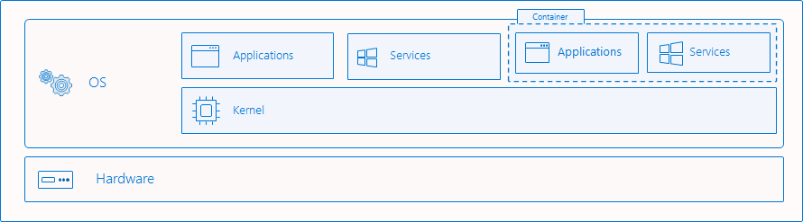
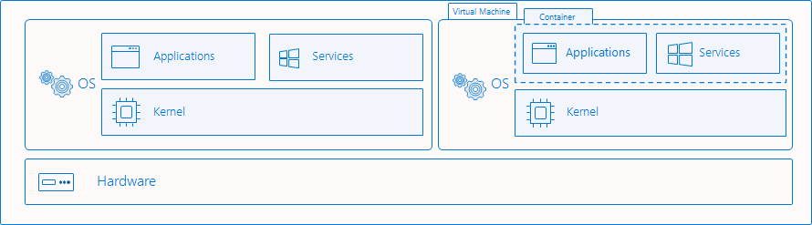

# Docker

## Windows containers

### Windows Server containers



- Share the same OS kernel, making them smaller. Because of this, the security concern is that if the container is compromised, then the host and all the other containers are also comprimsed.

### Windows Hyper-V containers



- They provide another layer of isolation, sacrificing performance for more security.

## Commands

## How to's

### Open a terminal in a running container

```powershell
docker exec -it <container_name> powershell
```

### Copy file to a container

> Warning! if this is done in a windows container, you might need to stop the container before copying the file.

```powershell
docker cp file.txt path <container_name>:/folder/
```

# TODO:

- Exposing a port in the dockerfile doesn't automatically means that well be mapped or "published" 